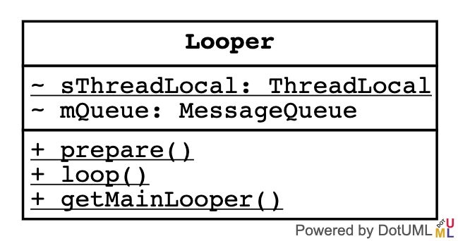

## 类图




## prepare

```java
public static void prepare() {
    prepare(true);
}

private static void prepare(boolean quitAllowed) {
    if (sThreadLocal.get() != null) {
        throw new RuntimeException("Only one Looper may be created per thread");
    }
    sThreadLocal.set(new Looper(quitAllowed));
}

/**
 * 构造方法中创建MessageQueue，并引用当前线程。
 * /
private Looper(boolean quitAllowed) {
    mQueue = new MessageQueue(quitAllowed);
    mThread = Thread.currentThread();
}
```

`Looper.prepare()`方法只是为了初始化`ThreadLocal`。

之前了解过，`ThreadLocal`可以包证多线程访问共享变量的线程安全问题。他不像`synchronized`靠阻塞实现线程安全，而是通过对变量拷贝的方式，使每一个线程都操作自己的拷贝，实现线程安全，所以效率要优于`synchronized`。[详情看这里](https://www.jianshu.com/p/6fc3bba12f38)和[这里](http://www.jasongj.com/java/threadlocal/)

由于在Android中每个线程都有个Looper对象，所以采用ThreadLocal来保存和获取当前线程的Looper对象。

## loop

只看核心：

```java
public static void loop() {
    final Looper me = myLooper();//其实就是从threadLocal中取出looper
    //省略判空

    me.mInLoop = true; //改变状态

    final MessageQueue queue = me.mQueue;//拿到MessageQueue

    Binder.clearCallingIdentity();
    final long ident = Binder.clearCallingIdentity();
    final int thresholdOverride =
            SystemProperties.getInt("log.looper."
                    + Process.myUid() + "."
                    + Thread.currentThread().getName()
                    + ".slow", 0);

    boolean slowDeliveryDetected = false;

    //接下来就是启动个死循环，为什么不用while而用for呢？
    for (;;) {
        Message msg = queue.next(); // 从MessageQueue中取出Message
        
        try {
            msg.target.dispatchMessage(msg);//调用Handler的dispatchMessage
        } catch (Exception exception) {
            //...
        } finally {
            //...
        }

        //无论如何都会回收消息
        msg.recycleUnchecked();
    }
```

## 主线程中为何不ANR也不会内存泄露

我们都知道线程一旦运行完毕就会回收，那么主线程中没有执行任何动作时为何不会回收呢？原因就是因为looper在死循环，阻塞了主线程的回收，那么相应的一旦不再死循环，程序也就退出了。Android同时利用Looper的死循环，发送消息，比如通知View重绘等等。
